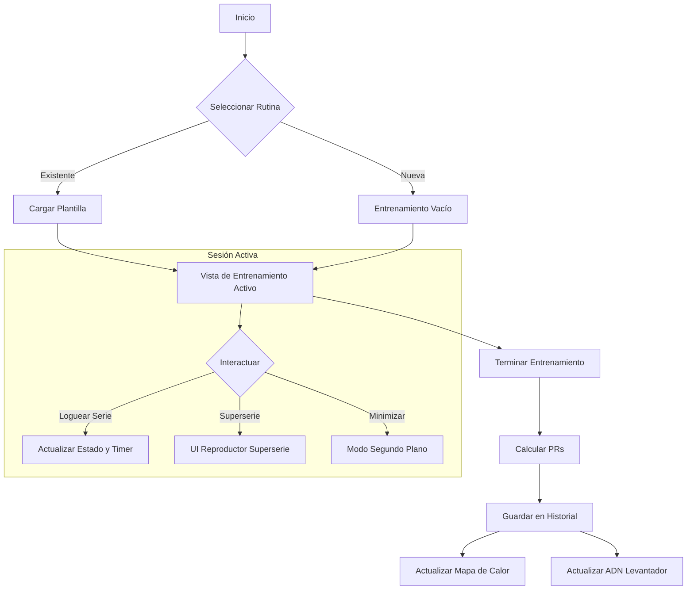
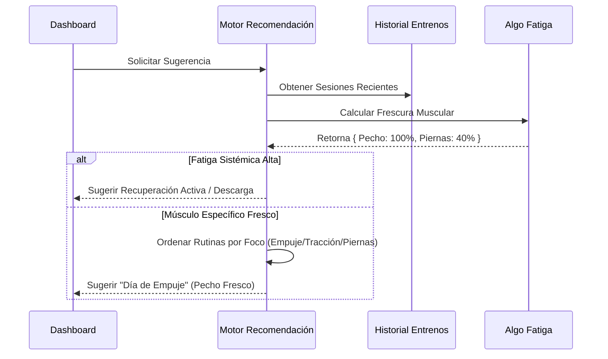
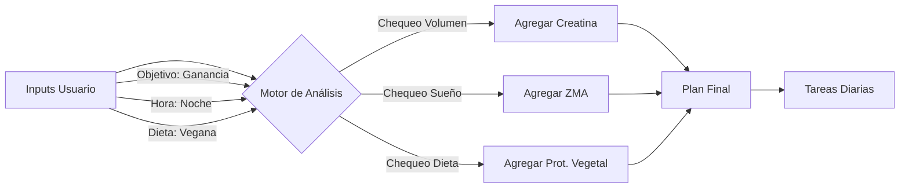

# Fortachon 🏋️‍♂️

**Fortachon** es una Progressive Web App (PWA) completa, enfocada en la privacidad y diseñada para el entrenamiento de fuerza serio. Combina un seguimiento avanzado de entrenamientos, analíticas biomecánicas y una planificación inteligente de suplementos en una sola aplicación con capacidad offline.

Hecha con **React**, **TypeScript** y **Tailwind CSS**.

## ✨ Características Clave

### 💪 Centro de Comando de Fuerza (¡Nuevo!)
*   **Hub de 1RM:** Un panel centralizado para gestionar los "4 Grandes" (Sentadilla, Banco Plano, Peso Muerto, Militar) y rastrear la fuerza en accesorios con estado de "Testeado" vs "Estimado".
*   **Protocolo "El Profesor":** Un asistente interactivo paso a paso para testear tu 1RM. Gestiona series de calentamiento, porcentajes y tiempos de descanso para asegurar un intento máximo seguro y preciso.
*   **Motor de Inferencia:** Detecta automáticamente cuando mejorás un levantamiento principal y sugiere actualizaciones de peso en cascada para los ejercicios accesorios relacionados (ej: mejora en Banco Plano -> actualización en Press Inclinado con Mancuernas) basado en ratios biomecánicos.
*   **Detección de PR en Vivo:** Notificaciones en tiempo real durante el entrenamiento activo cuando una serie realizada supera tu máximo teórico actual.
*   **Herramientas de Porcentaje:** Calculá y aplicá instantáneamente porcentajes de peso (ej: "Ajustar al 75%") en todo tu entrenamiento.

### 🏋️‍♂️ Entrenamiento y Seguimiento
*   **Modo de Entrenamiento Activo:** Seguimiento en tiempo real con soporte para **Superseries**, Drop Sets, Calentamientos y Series por Tiempo.
*   **Timers Inteligentes:** Temporizadores de descanso autocalculados basados en la intensidad de la serie (Calentamiento vs Fallo) con soporte en segundo plano.
*   **Coach de Voz:** Anuncios Text-to-Speech (TTS) para rondas, intervalos de descanso y próximos ejercicios.
*   **Modo HIIT Rápido:** Temporizador de intervalos dedicado para sesiones de alta intensidad con ratios de trabajo/descanso personalizables.
*   **Gestión de Rutinas:** Creá plantillas personalizadas o usá programas integrados (StrongLifts, PPL, PHUL).
*   **Reproductor de Superseries:** Una interfaz dedicada para manejar transiciones complejas de superseries y periodos de descanso.

### 📊 Analíticas e Insights
*   **Mapa de Calor Muscular:** Visualiza la frescura/fatiga muscular basada en tu volumen de entrenamiento de los últimos 4 días.
*   **Simetría de Fuerza:** Análisis de gráfico de radar comparando tus levantamientos principales contra ratios ideales para detectar desequilibrios estructurales.
*   **Fatiga Sistémica:** Monitorea la carga acumulada del SNC (Sistema Nervioso Central) para recomendar semanas de descarga.
*   **ADN del Levantador:** Analiza tu historial de entrenamiento para categorizar tu arquetipo (Powerbuilder, Fisicoculturista, Híbrido) y puntuar tu Constancia, Volumen e Intensidad.
*   **Seguimiento de Progresión:** Cálculo automático de **e1RM** (1RM Estimado) y tendencias de volumen por ejercicio.
*   **Recomendaciones Inteligentes:** Sugiere el entrenamiento óptimo para el día (ej: "Día de Empuje" vs "Recuperación Activa") basado en el estado de recuperación muscular.

### 💊 Nutrición y Salud
*   **Asistente de Suplementos:** Genera un cronograma de suplementos personalizado basado en peso, género, objetivos (definición/volumen) y condiciones médicas.
*   **Programación Contextual:** Ajusta automáticamente los horarios de los suplementos (ej: mover la proteína del desayuno al almuerzo) basado en tu horario de entrenamiento.
*   **Correlaciones Inteligentes:** Analiza el historial de entrenamiento contra los registros de suplementos para encontrar correlaciones (ej: "Levantás un 5% más de volumen cuando tomás Creatina").
*   **Gestión de Inventario:** Rastrea niveles de stock y envía recordatorios.

---

## 🧠 Inmersión Técnica: La Matemática detrás de la App

Fortachon corre enteramente del lado del cliente usando `localStorage`. A continuación, los algoritmos centrales que impulsan las analíticas.

### 1. 1-Rep Max Estimado (e1RM)
Usamos la **Fórmula de Epley** para estimar el potencial de fuerza a partir de series sub-máximas. Esto permite normalizar el rendimiento a través de diferentes rangos de repeticiones.

$$
1RM = w \cdot (1 + \frac{r}{30})
$$

*   $w$ = Peso levantado
*   $r$ = Repeticiones realizadas

### 2. Algoritmo de Frescura y Recuperación Muscular
La app calcula un "Puntaje de Frescura" (0-100%) para cada grupo muscular.
*   **Inducción de Fatiga:** Una serie crea unidades de fatiga basadas en el rol del músculo (Motor Primario vs. Secundario).
    *   Primario: 12 unidades
    *   Secundario: 6 unidades
*   **Perfil de Recuperación:** Cada músculo tiene una ventana de recuperación (ej: Cuádriceps = 72h, Abdominales = 24h).
*   **Recuperación Lineal:**

$$
\text{Fatiga}_{actual} = \text{Fatiga}_{inicial} \times (1 - \frac{\text{HorasDesdeEntreno}}{\text{DuracionRecuperacion}})
$$

$$
\text{Frescura} = \max(0, 100 - \text{Fatiga}_{actual})
$$

### 3. Puntuación de ADN del Levantador
Clasificamos a los usuarios basándonos en su historial de entrenamiento (últimas 20 sesiones).

*   **Arquetipo:** Determinado por el promedio de repeticiones ponderado por volumen ($R_{avg}$).
    *   $R_{avg} \le 7.5$: **Powerbuilder**
    *   $7.5 < R_{avg} \le 13$: **Bodybuilder** (Fisicoculturista)
    *   $R_{avg} > 13$: **Endurance** (Resistencia)
*   **Puntaje de Volumen:** Normalizado contra una línea base heurística (ej: 10,000kg volumen total = 100 puntos).
*   **Puntaje de Intensidad:** Heurística basada en rangos de repeticiones (menos repeticiones implican mayor % de 1RM).

### 4. Fatiga Sistémica (Carga del SNC)
Rastreamos el estrés del sistema nervioso central para prevenir el agotamiento (burnout).
*   **Costo Base:** Compuestos Pesados (4 pts) > Accesorios (2.5 pts) > Aislamiento (1 pt).
*   **Decaimiento:** Decaimiento exponencial sobre 7 días ($0.6^d$).

$$
\text{CargaSistemica} = \sum_{d=0}^{7} (\text{CargaSesion}_d \times 0.6^d)
$$

### 5. Ratios de Simetría de Fuerza
Los desequilibrios se detectan comparando tus 1RM estimados contra ratios estructurales idealizados:
*   **Banco Plano : Sentadilla** $\approx$ 3:4
*   **Sentadilla : Peso Muerto** $\approx$ 4:5
*   **Press Militar : Banco Plano** $\approx$ 2:3
*   **Empuje : Tracción** $\approx$ 1:1

### 6. Motor de Inferencia de Fuerza & Anclas Sintéticas
Para predecir el rendimiento en ejercicios que no has maxeado recientemente, la app usa un **Sistema de Ratios Biomecánicos**.

*   **Concepto:** Cada ejercicio está mapeado a un Ancla de los "4 Grandes" (Sentadilla, Banco, Peso Muerto, Militar) vía un ratio de palanca ($R$).
*   **Cálculo de Ancla Sintética:** Normalizamos cada serie que hacés para encontrar tu techo teórico en los levantamientos principales.
    $$
    \text{Max Ancla Teórico} = \frac{\text{Accesorio } e1RM}{R}
    $$
    *   *Ejemplo:* Si hacés Prensa de Piernas con 250kg por 10 reps ($e1RM \approx 333kg$) y el ratio es 2.5:
        $$
        \text{Max Sentadilla Teórico} = \frac{333}{2.5} = 133kg
        $$
*   **Inferencia:** Si tu máximo guardado de Banco Plano es 0, pero hacés Banco Inclinado con 80kg ($R=0.8$), inferimos que tu máximo de Banco Plano es $80 / 0.8 = 100kg$.
*   **Actualizaciones en Cascada:** Cuando testeás un nuevo 1RM verdadero en un Levantamiento Principal, el sistema sugiere automáticamente actualizar todos los accesorios hijos basado en $NuevoAncla \times R$.

### 7. La Matriz de Decisión del Coach Inteligente
El motor de recomendación (`smartCoachUtils.ts`) usa una jerarquía de necesidades para determinar la sugerencia diaria:

1.  **Fase 0: Seguridad (Override del SNC)**
    *   Si la Fatiga Sistémica > 110 (Alta), el motor fuerza una recomendación de **Descarga**, bloqueando sugerencias de levantamiento pesado para prevenir el sobreentrenamiento.

2.  **Fase 1: Formación de Hábito (El Plan "Pegajoso")**
    *   Para "Novatos" (< 10 sesiones), el motor ignora la frescura y se adhiere estrictamente al cronograma de onboarding del usuario (ej: A -> B -> A) para construir constancia.

3.  **Fase 2: Progresión (Promoción de Ejercicio)**
    *   El motor escanea el historial buscando "Criterios de Graduación".
    *   *Ejemplo:* Si un usuario realiza 3 sesiones de Sentadilla Copa (Goblet Squat) con > 35% de su peso corporal por 10+ reps, sugiere una mejora a **Sentadilla con Barra**.

4.  **Fase 3: Selección Avanzada (La Sesión "Puente")**
    *   Si la fatiga muscular local es alta (frescura promedio < 60%) Y ningún grupo muscular específico está totalmente recuperado:
    *   Genera una **Sesión Puente** (Recuperación Activa).
    *   **Lógica:**
        1.  Identificar **Puntos Débiles** (puntaje de fuerza normalizado más bajo).
        2.  Identificar **Músculos Protegidos** (motores primarios de la *próxima* sesión pesada predicha).
        3.  Seleccionar ejercicios de bajo impacto que apunten a los Puntos Débiles *sin* tocar los Músculos Protegidos.

5.  **Fase 4: Rendimiento (El Split)**
    *   Si los músculos están frescos, predice la siguiente rutina basada en patrones históricos (ej: Empuje -> Tracción -> Piernas) o selecciona la parte del cuerpo específica con el puntaje de frescura más alto.

---

## 🌊 Arquitectura del Sistema y Flujos

### 1. Ciclo de Vida de Sesión de Entrenamiento
El bucle central de la aplicación.



### 2. Motor de Recomendación Inteligente
Cómo la app decide qué deberías entrenar hoy (`razón_fresco` vs `razón_ignorado`).



### 3. Generación de Plan de Suplementos
Flujo lógico para el `SupplementService`.



---

## 📂 Estructura del Proyecto

```
/
├── src/
│   ├── components/      # Componentes de UI (Tarjetas, Modales, Gráficos)
│   ├── constants/       # Datos estáticos (Músculos, Rutinas Predefinidas)
│   ├── contexts/        # Contexto de React (Estado de App, I18n)
│   ├── hooks/           # Hooks Personalizados (useWeight, useWakeLock)
│   ├── locales/         # Traducciones i18n (EN/ES)
│   ├── pages/           # Vistas Principales de Rutas
│   ├── services/        # Lógica (Analíticas, Audio, Voz, Suplementos)
│   ├── utils/           # Funciones auxiliares (Matemática, Tiempo, Colores)
│   ├── App.tsx          # Router Principal
│   └── index.tsx        # Punto de Entrada
└── public/              # Assets Estáticos e Íconos
```

## 🚀 Primeros Pasos

1.  **Instalar Dependencias:**
    ```bash
    npm install
    ```

2.  **Correr Servidor de Desarrollo:**
    ```bash
    npm run dev
    ```

3.  **Compilar para Producción:**
    ```bash
    npm run build
    ```

## 🌍 Localización

Fortachon actualmente soporta **Inglés** y **Español**.
El `I18nContext` maneja el cambio de idioma en caliente, incluyendo descripciones complejas de ejercicios y anuncios TTS (Texto a Voz).
