# Fortachon 🏋️‍♂️

**Fortachon** es una Progressive Web App (PWA) integral, enfocada en la privacidad y diseñada para quienes se toman el entrenamiento de fuerza en serio. Combina el registro avanzado de entrenamientos, analíticas biomecánicas y una planificación inteligente de suplementación en una sola aplicación que funciona sin conexión.

Desarrollada con **React**, **TypeScript** y **Tailwind CSS**.

## ✨ Características Principales

### 💪 Centro de Control de Fuerza (¡Nuevo!)
*   **Panel de 1RM:** Un dashboard centralizado para gestionar los "4 Grandes" (Sentadilla, Banco Plano, Peso Muerto, Militar) y monitorear la fuerza en ejercicios accesorios, diferenciando entre máximos "Testeados" y "Estimados".
*   **Protocolo "El Profesor":** Un asistente interactivo que te guía paso a paso para testear tu 1RM. Gestiona automáticamente las series de aproximación (calentamiento), los porcentajes y los tiempos de descanso para asegurar un intento máximo seguro y preciso.
*   **Motor de Inferencia:** Detecta automáticamente cuando mejorás en un levantamiento principal y sugiere actualizaciones de peso en cascada para los ejercicios accesorios relacionados (ej: mejorás en Banco Plano -> te sugiere subir el peso en Press Inclinado con Mancuernas) basándose en ratios biomecánicos.
*   **Detección de PR en Vivo:** Recibí notificaciones en tiempo real durante el entrenamiento si una serie que acabás de hacer supera tu máximo teórico actual.
*   **Calculadora de Porcentajes:** Calculá y aplicá instantáneamente porcentajes de carga (ej: "Ajustar todo al 75%") en tu rutina.

### 🏋️‍♂️ Entrenamiento y Seguimiento
*   **Modo Entrenamiento Activo:** Registro en tiempo real con soporte nativo para **Superseries**, Drop Sets, Series de Aproximación y Series por Tiempo.
*   **Temporizadores Inteligentes:** El tiempo de descanso se calcula solo según la intensidad de la serie (no es lo mismo descansar después de calentar que después de fallar) y corre en segundo plano.
*   **Coach de Voz:** Anuncios Text-to-Speech (TTS) que te cantan las rondas, los intervalos de descanso y qué ejercicio sigue.
*   **Modo HIIT Express:** Un timer de intervalos dedicado para sesiones de alta intensidad con ratios de trabajo/descanso totalmente configurables.
*   **Gestión de Rutinas:** Creá tus propias plantillas o usá los programas pre-cargados (StrongLifts, PPL, PHUL).
*   **Reproductor de Superseries:** Una interfaz específica para manejar las transiciones y descansos en bloques de ejercicios complejos sin perderte.

### 📊 Analíticas e Insights
*   **Mapa de Calor Muscular:** Visualizá qué tan frescos o fatigados están tus músculos basándose en el volumen de tus últimos 4 días.
*   **Simetría de Fuerza:** Un gráfico de radar que compara tus levantamientos principales contra ratios ideales para detectar desequilibrios estructurales (ej: si tenés mucho pecho pero poca espalda).
*   **Fatiga Sistémica:** Monitorea la carga acumulada en tu Sistema Nervioso Central (SNC) para recomendarte cuándo hacer una semana de descarga.
*   **ADN del Atleta:** Analiza tu historial para categorizar tu arquetipo (Powerbuilder, Bodybuilder, Híbrido) y puntúa tu Constancia, Volumen e Intensidad.
*   **Progreso Automático:** Cálculo automático del **e1RM** (1RM Estimado) y tendencias de volumen por ejercicio.
*   **Recomendaciones Inteligentes:** El sistema te sugiere qué entrenar hoy (ej: "Día de Empuje" vs "Recuperación Activa") basándose en qué músculos ya se recuperaron.

### 💊 Nutrición y Salud
*   **Asistente de Suplementación:** Genera un plan de suplementos a medida basándose en tu peso, género, objetivos (volumen/definición) y condiciones médicas.
*   **Cronograma Inteligente:** Ajusta automáticamente los horarios de toma (ej: mueve la proteína del desayuno al almuerzo) si cambiás tu horario de entrenamiento.
*   **Correlaciones:** Cruza los datos de tus entrenamientos con el registro de suplementos para encontrar patrones (ej: "Rendís un 5% más en volumen cuando tomás Creatina").
*   **Control de Stock:** Llevá la cuenta de tus suplementos y recibí alertas cuando te estés quedando sin stock.

---

## 🧠 Profundización Técnica: La Matemática detrás de la App

Fortachon se ejecuta totalmente del lado del cliente (client-side) usando `localStorage`. Estos son los algoritmos clave que mueven la app:

### 1. 1-Rep Max Estimado (e1RM)
Usamos la **Fórmula de Epley** para proyectar tu potencial de fuerza a partir de series sub-máximas. Esto nos permite normalizar el rendimiento sin importar el rango de repeticiones que uses.

$$
1RM = w \cdot (1 + \frac{r}{30})
$$

*   $w$ = Peso levantado
*   $r$ = Repeticiones realizadas

### 2. Algoritmo de Frescura y Recuperación
La app calcula un "Puntaje de Frescura" (0-100%) para cada grupo muscular.
*   **Inducción de Fatiga:** Cada serie genera unidades de fatiga según el rol del músculo en el ejercicio (Motor Primario vs. Secundario).
    *   Primario: 12 unidades
    *   Secundario: 6 unidades
*   **Perfil de Recuperación:** Cada músculo tiene su propia ventana de recuperación (ej: Cuádriceps = 72hs, Abdominales = 24hs).
*   **Recuperación Lineal:**

$$
\text{Fatiga}_{actual} = \text{Fatiga}_{inicial} \times (1 - \frac{\text{HorasDesdeEntreno}}{\text{DuracionRecuperacion}})
$$

$$
\text{Frescura} = \max(0, 100 - \text{Fatiga}_{actual})
$$

### 3. Puntuación de ADN del Atleta
Te clasificamos basándonos en tu historial (últimas 20 sesiones).

*   **Arquetipo:** Se determina por el promedio de repeticiones ponderado por volumen ($R_{avg}$).
    *   $R_{avg} \le 7.5$: **Powerbuilder** (Fuerza)
    *   $7.5 < R_{avg} \le 13$: **Bodybuilder** (Hipertrofia)
    *   $R_{avg} > 13$: **Endurance** (Resistencia)
*   **Puntaje de Volumen:** Normalizado contra una línea base heurística (ej: 10,000kg de volumen total = 100 puntos).
*   **Puntaje de Intensidad:** Heurística basada en rangos de repeticiones (menos reps implican mayor % del 1RM).

### 4. Fatiga Sistémica (Carga del SNC)
Rastreamos el estrés sobre el sistema nervioso central para prevenir el "burnout".
*   **Costo Base:** Compuestos Pesados (4 pts) > Accesorios (2.5 pts) > Aislamiento (1 pt).
*   **Decaimiento:** Decaimiento exponencial en una ventana de 7 días ($0.6^d$).

$$
\text{CargaSistemica} = \sum_{d=0}^{7} (\text{CargaSesion}_d \times 0.6^d)
$$

### 5. Ratios de Simetría de Fuerza
Detectamos desequilibrios comparando tus 1RM estimados contra ratios estructurales idealizados:
*   **Banco Plano : Sentadilla** $\approx$ 3:4
*   **Sentadilla : Peso Muerto** $\approx$ 4:5
*   **Press Militar : Banco Plano** $\approx$ 2:3
*   **Empuje : Tracción** $\approx$ 1:1

### 6. Motor de Inferencia y Anclas Sintéticas
Para predecir cuánto levantás en ejercicios que no hacés seguido, la app usa un **Sistema de Ratios Biomecánicos**.

*   **Concepto:** Cada ejercicio está vinculado a un "Ancla" de los 4 Grandes (Sentadilla, Banco, Peso Muerto, Militar) mediante un ratio de palanca ($R$).
*   **Cálculo de Ancla Sintética:** Normalizamos cada serie que hacés para encontrar tu techo teórico en los levantamientos principales.

$$
\text{Max Ancla Teórico} = \frac{\text{Accesorio} \times \text{e1RM}}{R}
$$

*   *Ejemplo:* Si hacés Prensa de Piernas con 250kg a 10 reps ($e1RM \approx 333kg$) y el ratio es 2.5:

$$
\text{Max Sentadilla Teórico} = \frac{333}{2.5} = 133\text{kg}
$$

*   **Inferencia:** Si tu máximo guardado de Banco Plano es 0, pero hacés Banco Inclinado con 80kg ($R=0.8$), inferimos que tu máximo de Banco Plano es $80 / 0.8 = 100kg$.
*   **Actualización en Cascada:** Cuando testeás un 1RM real en un ejercicio principal, el sistema te sugiere actualizar todos los ejercicios accesorios hijos basándose en $NuevoAncla \times R$.

### 7. Matriz de Decisión del Smart Coach
El motor de recomendación (`smartCoachUtils.ts`) usa una jerarquía de necesidades para decidir qué sugerirte:

1.  **Fase 0: Seguridad (Bloqueo por SNC)**
    *   Si la Fatiga Sistémica > 110 (Alta), el motor fuerza una recomendación de **Descarga**, bloqueando sugerencias de levantamiento pesado para evitar sobreentrenamiento.

2.  **Fase 1: Formación de Hábito (El Plan Fijo)**
    *   Para "Novatos" (< 10 sesiones), el motor ignora la frescura y se adhiere estrictamente al cronograma de onboarding (ej: A -> B -> A) para construir el hábito.

3.  **Fase 2: Progresión (Promoción de Ejercicio)**
    *   El motor escanea el historial buscando "Criterios de Graduación".
    *   *Ejemplo:* Si un usuario realiza 3 sesiones de Sentadilla Copa (Goblet) con > 35% de su peso corporal por 10+ reps, sugiere pasar a **Sentadilla con Barra**.

4.  **Fase 3: Selección Avanzada (La Sesión "Puente")**
    *   Si la fatiga muscular local es alta (frescura promedio < 60%) Y ningún grupo muscular específico está totalmente recuperado:
    *   Genera una **Sesión Puente** (Recuperación Activa).
    *   **Lógica:**
        1.  Identifica **Puntos Débiles** (puntaje de fuerza normalizado más bajo).
        2.  Identifica **Músculos Protegidos** (motores primarios de la *próxima* sesión pesada predicha).
        3.  Selecciona ejercicios de bajo impacto que ataquen los Puntos Débiles *sin* tocar los Músculos Protegidos.

5.  **Fase 4: Rendimiento (El Split)**
    *   Si los músculos están frescos, predice la siguiente rutina basada en patrones históricos (ej: Empuje -> Tracción -> Piernas) o selecciona la parte del cuerpo específica con el puntaje de frescura más alto.

---

## 🌊 Arquitectura y Flujos del Sistema

### 1. Ciclo de Vida de la Sesión
El bucle central de la aplicación.

```mermaid
graph TD
    A[Inicio] --> B{Seleccionar Rutina}
    B -->|Existente| C[Cargar Plantilla]
    B -->|Nueva| D[Entrenamiento Vacío]
    C --> E[Vista de Entrenamiento Activo]
    D --> E
    
    subgraph Sesión Activa
    E --> F{Interactuar}
    F -->|Loguear Serie| G[Actualizar Estado y Timer]
    F -->|Superserie| H[UI Reproductor Superserie]
    F -->|Minimizar| I[Modo Segundo Plano]
    end
    
    E --> J[Terminar Entrenamiento]
    J --> K[Calcular PRs]
    K --> L[Guardar en Historial]
    L --> M[Actualizar Mapa de Calor]
    L --> N[Actualizar ADN Atleta]
```

### 2. Motor de Recomendación Inteligente
Cómo la app decide qué deberías entrenar hoy.



```mermaid
sequenceDiagram
    participant UI as Dashboard
    participant Heuristica as Motor Recomendación
    participant Historial as Historial Entrenos
    participant Fatiga as Algo Fatiga

    UI->>Heuristica: Solicitar Sugerencia
    Heuristica->>Historial: Obtener Sesiones Recientes
    Heuristica->>Fatiga: Calcular Frescura Muscular
    Fatiga-->>Heuristica: Retorna { Pecho: 100%, Piernas: 40% }
    
    alt Fatiga Sistémica Alta
        Heuristica-->>UI: Sugerir Recuperación Activa / Descarga
    else Músculo Específico Fresco
        Heuristica->>Heuristica: Ordenar Rutinas por Foco (Empuje/Tracción/Piernas)
        Heuristica-->>UI: Sugerir "Día de Empuje" (Pecho Fresco)
    end
```

### 3. Generación de Plan de Suplementos
Flujo lógico para el `SupplementService`.

```mermaid
graph LR
    Input[Inputs Usuario] --> Logic{Motor de Análisis}
    
    Input -->|Objetivo: Ganancia| Logic
    Input -->|Hora: Noche| Logic
    Input -->|Dieta: Vegana| Logic
    
    Logic -->|Chequeo Volumen| Creatina[Agregar Creatina]
    Logic -->|Chequeo Sueño| ZMA[Agregar ZMA]
    Logic -->|Chequeo Dieta| Proteina[Agregar Prot. Vegetal]
    
    Creatina --> Output[Plan Final]
    ZMA --> Output
    Proteina --> Output
    
    Output --> Schedule[Tareas Diarias]
```



---

## 📂 Estructura del Proyecto

```
/
├── src/
│   ├── components/      # Componentes UI (Tarjetas, Modales, Gráficos)
│   ├── constants/       # Datos estáticos (Músculos, Rutinas Predefinidas)
│   ├── contexts/        # Contexto React (Estado Global, I18n)
│   ├── hooks/           # Hooks Personalizados (useWeight, useWakeLock)
│   ├── locales/         # Traducciones i18n (EN/ES)
│   ├── pages/           # Vistas Principales
│   ├── services/        # Lógica Pura (Analíticas, Audio, Voz, Suplementos)
│   ├── utils/           # Helpers (Matemática, Tiempo, Colores)
│   ├── App.tsx          # Router Principal
│   └── index.tsx        # Punto de Entrada
└── public/              # Assets Estáticos e Íconos
```

## 🚀 Primeros Pasos

1.  **Instalar Dependencias:**
    ```bash
    npm install
    ```

2.  **Correr Servidor de Desarrollo:**
    ```bash
    npm run dev
    ```

3.  **Compilar para Producción:**
    ```bash
    npm run build
    ```

## 🌍 Localización

Fortachon soporta **Inglés** y **Español**.
El `I18nContext` maneja el cambio de idioma en caliente, incluyendo descripciones complejas de ejercicios y los anuncios del coach por voz (TTS).
