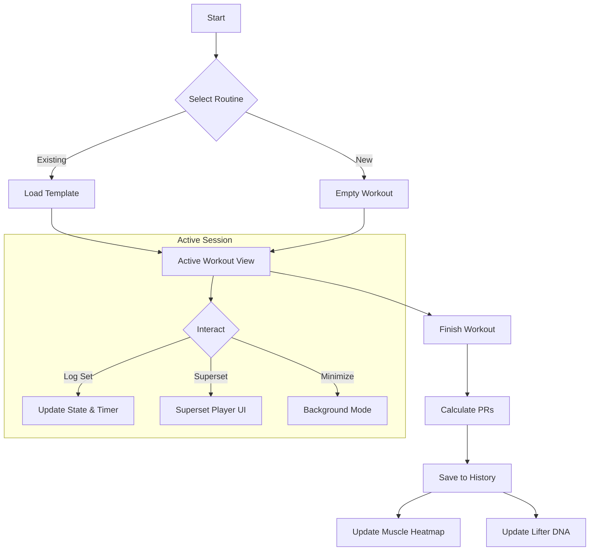
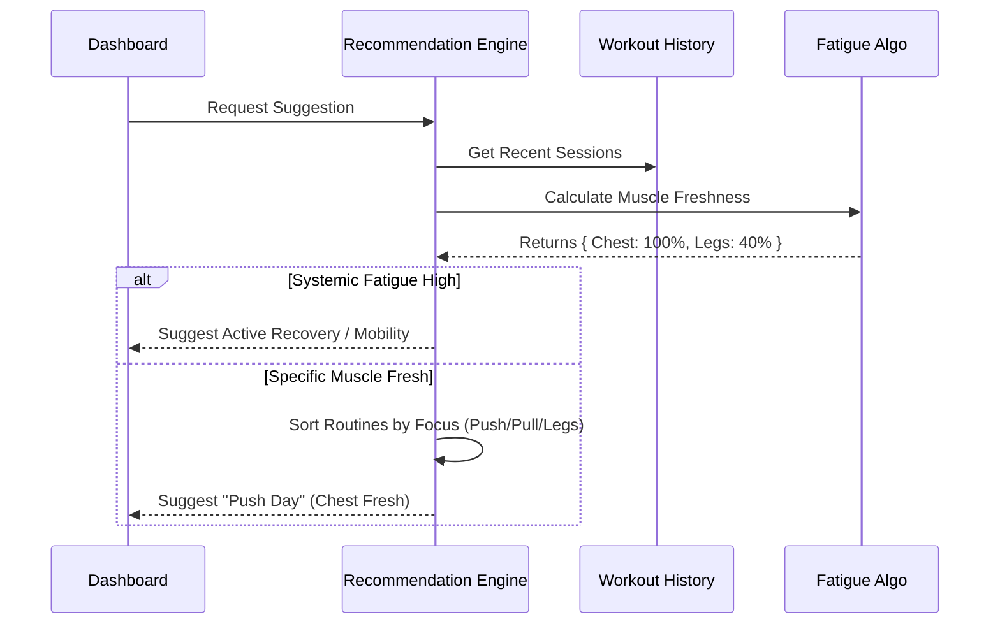
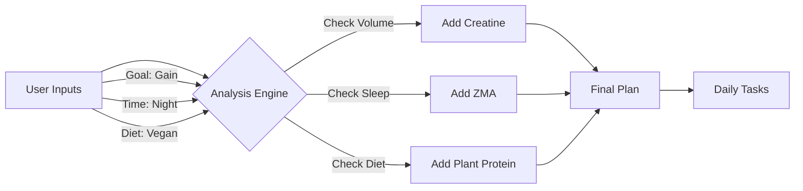
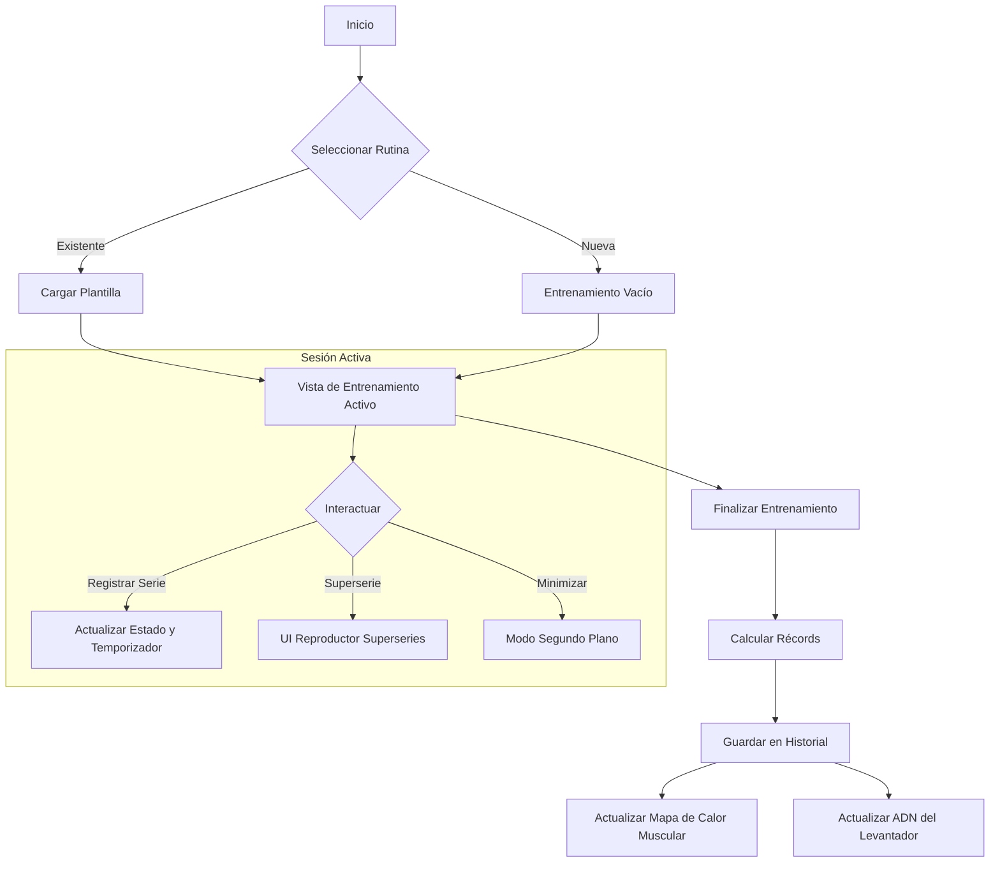
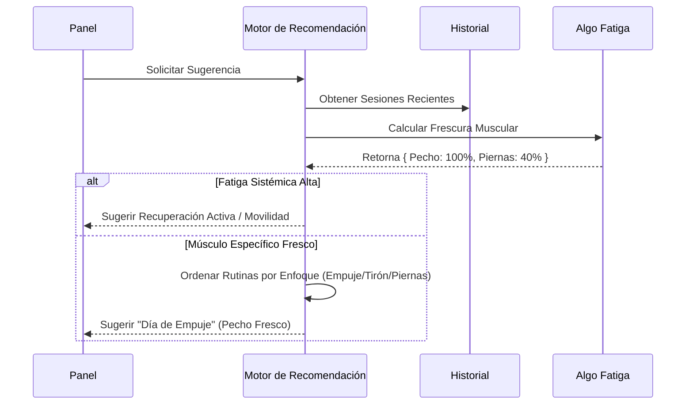
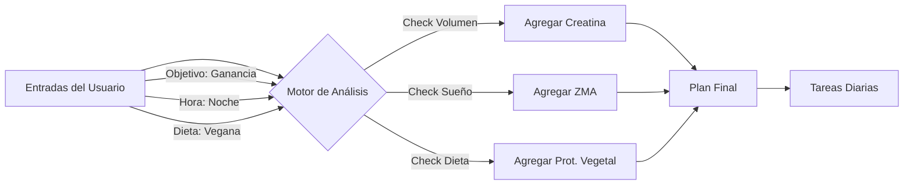

# Fortachon 🏋️‍♂️

**Fortachon** is a comprehensive, privacy-focused Progressive Web App (PWA) designed for serious strength training. It combines advanced workout tracking, biomechanical analytics, and intelligent supplement planning into a single, offline-capable application.

Built with **React**, **TypeScript**, and **Tailwind CSS**.

## ✨ Key Features

### 🏋️‍♂️ Training & Tracking
*   **Active Workout Mode:** Real-time tracking with support for **Supersets**, Drop Sets, Warmups, and Timed Sets.
*   **Smart Timers:** Auto-calculating rest timers based on set intensity (Warmup vs. Failure) with background notification support.
*   **Routine Management:** Create custom templates or use built-in programs (StrongLifts, PPL, PHUL).
*   **Superset Player:** A dedicated UI for managing complex superset transitions and rest periods.

### 📊 Analytics & Insights
*   **Muscle Heatmap:** Visualizes muscle freshness/fatigue based on your last 4 days of training volume.
*   **Lifter DNA:** Analyzes your training history to categorize your archetype (Powerbuilder, Bodybuilder, Hybrid) and score your Consistency, Volume, and Intensity.
*   **Progression Tracking:** Automatic calculation of **e1RM** (Estimated 1-Rep Max) and volume trends per exercise.
*   **Smart Recommendations:** Suggests the optimal workout for the day based on muscle recovery status.

### 💊 Nutrition & Health
*   **Supplement Wizard:** Generates a personalized supplement schedule based on weight, gender, goals (cut/bulk), and medical conditions.
*   **Smart Correlations:** Analyzes workout history against supplement logs to find correlations (e.g., "You lift 5% more volume when taking Creatine").
*   **Inventory Management:** Tracks stock levels and sends reminders.

---

## 🧠 Technical Deep Dive: The Math Behind the App

Fortachon runs entirely client-side using `localStorage`. Below are the core algorithms driving the analytics.

### 1. Estimated 1-Rep Max (e1RM)
We use the **Epley Formula** to estimate strength potential from sub-maximal sets. This allows for normalization of performance across different rep ranges.

$$
1RM = w \cdot (1 + \frac{r}{30})
$$

*   $w$ = Weight lifted
*   $r$ = Repetitions performed

### 2. Muscle Freshness & Recovery Algorithm
The app calculates a "Freshness Score" (0-100%) for every muscle group.
*   **Fatigue Induction:** A set creates fatigue units based on muscle role (Primary vs. Secondary mover).
    *   Primary: 12 units
    *   Secondary: 6 units
*   **Recovery Profile:** Each muscle has a recovery window (e.g., Quads = 72h, Abs = 24h).
*   **Linear Recovery:**

$$
\text{Fatigue}_{current} = \text{Fatigue}_{initial} \times (1 - \frac{\text{HoursSinceWorkout}}{\text{RecoveryDuration}})
$$

$$
\text{Freshness} = \max(0, 100 - \text{Fatigue}_{current})
$$

### 3. Lifter DNA Scoring
We classify users based on their training history (last 20 sessions).

*   **Archetype:** Determined by average repetitions per set ($R_{avg}$).
    *   $R_{avg} \le 6$: **Powerbuilder**
    *   $6 < R_{avg} \le 12$: **Bodybuilder**
    *   $R_{avg} > 12$: **Endurance**
*   **Volume Score:** Normalized against a heuristic baseline (e.g., 10,000kg total volume = 100 points).
*   **Intensity Score:** Heuristic based on rep ranges (lower reps imply higher % of 1RM).

---

## 🌊 System Architecture & Flows

### 1. Workout Session Lifecycle
The core loop of the application.



### 2. Smart Recommendation Engine
How the app decides what you should train today (`rec_reason_fresh` vs `rec_reason_neglected`).



### 3. Supplement Plan Generation
Logic flow for the `SupplementService`.



---

## 📂 Project Structure

```
/
├── src/
│   ├── components/      # UI Components (Cards, Modals, Graphs)
│   ├── constants/       # Static data (Muscles, Predefined Routines)
│   ├── contexts/        # React Context (App State, I18n)
│   ├── hooks/           # Custom Hooks (useWeight, useWakeLock)
│   ├── locales/         # i18n translations (EN/ES)
│   ├── pages/           # Main Route Views
│   ├── services/        # Logic (Analytics, Audio, Speech, Supplements)
│   ├── utils/           # Helper functions (Math, Time, Colors)
│   ├── App.tsx          # Main Router
│   └── index.tsx        # Entry Point
└── public/              # Static Assets & Icons
```

## 🚀 Getting Started

1.  **Install Dependencies:**
    ```bash
    npm install
    ```

2.  **Run Development Server:**
    ```bash
    npm run dev
    ```

3.  **Build for Production:**
    ```bash
    npm run build
    ```

## 🌍 Localization

Fortachon currently supports **English** and **Spanish**. 
The `I18nContext` handles hot-swapping languages, including complex exercise descriptions and TTS (Text-to-Speech) announcements.

---

# Fortachon 🏋️‍♂️ (Español)

**Fortachon** es una Aplicación Web Progresiva (PWA) integral y centrada en la privacidad, diseñada para el entrenamiento de fuerza serio. Combina un seguimiento avanzado de entrenamientos, análisis biomecánicos y una planificación inteligente de suplementos en una sola aplicación con capacidad offline.

Construida con **React**, **TypeScript** y **Tailwind CSS**.

## ✨ Características Clave

### 🏋️‍♂️ Entrenamiento y Seguimiento
*   **Modo de Entrenamiento Activo:** Seguimiento en tiempo real con soporte para **Superseries**, Drop Sets, Calentamientos y Series Cronometradas.
*   **Temporizadores Inteligentes:** Temporizadores de descanso calculados automáticamente según la intensidad de la serie (Calentamiento vs. Fallo) con soporte para notificaciones en segundo plano.
*   **Gestión de Rutinas:** Creá plantillas personalizadas o usá programas integrados (StrongLifts, PPL, PHUL).
*   **Reproductor de Superseries:** Una interfaz dedicada para gestionar transiciones complejas de superseries y períodos de descanso.

### 📊 Análisis e Insights
*   **Mapa de Calor Muscular:** Visualiza la frescura/fatiga muscular basada en tus últimos 4 días de volumen de entrenamiento.
*   **ADN del Levantador:** Analiza tu historial de entrenamiento para categorizar tu arquetipo (Powerbuilder, Bodybuilder, Híbrido) y puntuar tu Consistencia, Volumen e Intensidad.
*   **Seguimiento de Progresión:** Cálculo automático de **e1RM** (1-Rep Max Estimado) y tendencias de volumen por ejercicio.
*   **Recomendaciones Inteligentes:** Sugiere el entrenamiento óptimo para el día basado en el estado de recuperación muscular.

### 💊 Nutrición y Salud
*   **Asistente de Suplementos:** Genera un programa de suplementos personalizado basado en peso, género, objetivos (definición/volumen) y condiciones médicas.
*   **Correlaciones Inteligentes:** Analiza el historial de entrenamiento contra los registros de suplementos para encontrar correlaciones (ej: "Levantás un 5% más de volumen cuando tomás Creatina").
*   **Gestión de Inventario:** Rastrea niveles de stock y envía recordatorios.

---

## 🧠 Profundización Técnica: La Matemática Detrás de la App

Fortachon se ejecuta completamente del lado del cliente usando `localStorage`. A continuación, los algoritmos principales que impulsan los análisis.

### 1. 1-Rep Max Estimado (e1RM)
Usamos la **Fórmula de Epley** para estimar el potencial de fuerza a partir de series sub-máximas. Esto permite la normalización del rendimiento a través de diferentes rangos de repeticiones.

$$
1RM = w \cdot (1 + \frac{r}{30})
$$

*   $w$ = Peso levantado
*   $r$ = Repeticiones realizadas

### 2. Algoritmo de Frescura Muscular y Recuperación
La app calcula una "Puntuación de Frescura" (0-100%) para cada grupo muscular.
*   **Inducción de Fatiga:** Una serie crea unidades de fatiga basadas en el rol del músculo (Motor Primario vs. Secundario).
    *   Primario: 12 unidades
    *   Secundario: 6 unidades
*   **Perfil de Recuperación:** Cada músculo tiene una ventana de recuperación (ej: Cuádriceps = 72h, Abdominales = 24h).
*   **Recuperación Lineal:**

$$
\text{Fatiga}_{actual} = \text{Fatiga}_{inicial} \times (1 - \frac{\text{HorasDesdeEntreno}}{\text{DuraciónRecuperación}})
$$

$$
\text{Frescura} = \max(0, 100 - \text{Fatiga}_{actual})
$$

### 3. Puntuación de ADN del Levantador
Clasificamos a los usuarios basándonos en su historial de entrenamiento (últimas 20 sesiones).

*   **Arquetipo:** Determinado por el promedio de repeticiones por serie ($R_{avg}$).
    *   $R_{avg} \le 6$: **Powerbuilder**
    *   $6 < R_{avg} \le 12$: **Bodybuilder**
    *   $R_{avg} > 12$: **Endurance** (Resistencia)
*   **Puntuación de Volumen:** Normalizada contra una línea base heurística (ej: 10,000kg de volumen total = 100 puntos).
*   **Puntuación de Intensidad:** Heurística basada en rangos de repeticiones (menos repeticiones implican mayor % de 1RM).

---

## 🌊 Arquitectura del Sistema y Flujos

### 1. Ciclo de Vida de la Sesión de Entrenamiento
El bucle central de la aplicación.



### 2. Motor de Recomendación Inteligente
Cómo la app decide qué debés entrenar hoy.



### 3. Generación del Plan de Suplementos
Flujo lógico para el `SupplementService`.



---

## 📂 Estructura del Proyecto

```
/
├── src/
│   ├── components/      # Componentes UI (Tarjetas, Modales, Gráficos)
│   ├── constants/       # Datos estáticos (Músculos, Rutinas Predefinidas)
│   ├── contexts/        # React Context (Estado App, I18n)
│   ├── hooks/           # Hooks Personalizados (useWeight, useWakeLock)
│   ├── locales/         # Traducciones i18n (EN/ES)
│   ├── pages/           # Vistas de Rutas Principales
│   ├── services/        # Lógica (Análisis, Audio, Voz, Suplementos)
│   ├── utils/           # Funciones auxiliares (Matemáticas, Tiempo, Colores)
│   ├── App.tsx          # Router Principal
│   └── index.tsx        # Punto de Entrada
└── public/              # Activos Estáticos e Iconos
```

## 🚀 Empezando

1.  **Instalar Dependencias:**
    ```bash
    npm install
    ```

2.  **Ejecutar Servidor de Desarrollo:**
    ```bash
    npm run dev
    ```

3.  **Construir para Producción:**
    ```bash
    npm run build
    ```

## 🌍 Localización

Fortachon actualmente soporta **Inglés** y **Español**.
El `I18nContext` maneja el cambio de idioma en caliente, incluyendo descripciones complejas de ejercicios y anuncios TTS (Texto a Voz).
