# Fortachon 🏋️‍♂️

**Fortachon** is a comprehensive, privacy-focused Progressive Web App (PWA) designed for serious strength training. It combines advanced workout tracking, biomechanical analytics, and intelligent supplement planning into a single, offline-capable application.

Built with **React**, **TypeScript**, and **Tailwind CSS**.

## ✨ Key Features

### 💪 Strength Command Center (New!)
*   **1RM Hub:** Centralized dashboard for managing the "Core 4" lifts (Squat, Bench, Deadlift, OHP) and tracking accessory strength with "Tested" vs "Estimated" status.
*   **"The Professor" Protocol:** A guided, step-by-step interactive wizard for testing 1RM. It manages warmup sets, percentages, and rest timers to ensure a safe and accurate max attempt.
*   **Inference Engine:** Automatically detects when a main lift improves and suggests cascading weight updates for related accessory exercises (e.g., Bench Press increase -> Incline DB Press update) based on biomechanical ratios.
*   **Live PR Detection:** Real-time notifications during active workouts when a performed set exceeds your current theoretical max.
*   **Percentage Tools:** Instantly calculate and apply weight percentages (e.g., "Set to 75%") across your workout.

### 🧠 Active Coaching & Auto-Regulation
*   **Active Insights:** A "Just-in-Time" calibration system that appears *during* your workout. It analyzes your previous performance to suggest specific weight jumps ("Crushed it last time! +2.5kg?") or deloads ("It's been 21 days. Ease back in.").
*   **Silent RPE:** The app infers your Rate of Perceived Exertion (RPE) without asking you. It looks at which Rest Timer you used (Warmup vs. Failure) and how long you rested to determine if you are ready to progress or need to hold steady.
*   **The Plate Detective:** The app learns your gym's equipment. By analyzing your history, it detects if you have micro-plates (1.25kg) or if you are limited to 5kg jumps, rounding its suggestions to match your reality.
*   **Smart Prefill:** Never start with an empty bar (unless you want to). New workouts auto-populate weights based on your Last Performance, % of 1RM, or biomechanical inference from other lifts.
*   **Goal Drift Detection:** If you set your goal to "Strength" but consistently do 12 reps, the Smart Coach detects the mismatch and prompts you to update your profile or adjust your training.

### 🏋️‍♂️ Training & Tracking
*   **Active Workout Mode:** Real-time tracking with support for **Supersets**, Drop Sets, Warmups, and Timed Sets.
*   **Smart Timers:** Auto-calculating rest timers based on set intensity (Warmup vs. Failure) with background notification support.
*   **Interactive Visual Database:** Detailed SVG animations for exercises and dynamic anatomical maps highlighting primary vs. secondary muscle targets.
*   **Voice Coach:** Anuncios Text-to-Speech (TTS) que te cantan las rondas, los intervalos de descanso y qué ejercicio sigue.
*   **Audio Procedural:** Efectos de sonido sintetizados en tiempo real (ticks, campanas) para temporizadores, sin depender de archivos externos, asegurando un rendimiento ligero.
*   **Quick HIIT Mode:** Dedicated interval timer for high-intensity sessions with customizable work/rest ratios.
*   **Routine Management:** Create custom templates or use built-in programs (StrongLifts, PPL, PHUL).
*   **Superset Player:** A dedicated UI for managing complex superset transitions and rest periods.
*   **Stale Session Guard:** Auto-detection of abandoned workouts (>3 hours) to prevent skewing duration analytics.

### 📊 Analytics & Insights
*   **Muscle Heatmap:** Visualizes muscle freshness/fatigue based on your last 4 days of training volume.
*   **Strength Symmetry:** Radar chart analysis comparing your major lifts (Squat, Bench, Deadlift, OHP, Row) against ideal ratios to detect structural imbalances.
*   **Systemic Fatigue:** Monitors cumulative CNS (Central Nervous System) load to recommend deload weeks.
*   **Lifter DNA:** Analyzes your training history to categorize your archetype (Powerbuilder, Bodybuilder, Hybrid) and score your Consistency, Volume, and Intensity.
*   **Skill Milestones:** A gamified "Unlock" system that tracks specific strength milestones (e.g., mastering Goblet Squats) to graduate you to more complex compound movements.
*   **Progression Tracking:** Automatic calculation of **e1RM** (Estimated 1-Rep Max) and volume trends per exercise.
*   **Data Freedom:** Export your workout history and visualization charts as **CSV**, **JSON**, or **PNG** images to share your progress.
*   **Smart Recommendations:** Suggests the optimal workout for the day (e.g., "Push Day" vs "Active Recovery") based on muscle recovery status.

### 💊 Nutrition & Health
*   **Supplement Wizard:** Generates a personalized supplement schedule based on weight, gender, goals (cut/bulk), and medical conditions.
*   **Proactive Supplement Coach:** An AI engine that actively reviews your training volume trends to suggest stack adjustments (e.g., "Add Creatine" if volume spikes, or "Remove Pre-workout" during injury deloads).
*   **Context-Aware Scheduling:** Automatically adjusts supplement timing (e.g., moving Protein from Breakfast to Lunch) based on your workout schedule.
*   **Smart Correlations:** Analyzes workout history against supplement logs to find correlations (e.g., "You lift 5% more volume when taking Creatine").
*   **In-App Stock Alerts:** Visual badges and reminders within the daily schedule when supplies run low.

---

## 🧠 Technical Deep Dive: The Math Behind the App

Fortachon runs entirely client-side using `localStorage`. Below are the core algorithms driving the analytics.

### 1. Estimated 1-Rep Max (e1RM)
We use the **Lombardi Formula** to estimate strength potential from sub-maximal sets. This was chosen over Epley for better accuracy at higher rep ranges (preventing overestimation).

$$
1RM = w \cdot r^{0.10}
$$

*   $w$ = Weight lifted
*   $r$ = Repetitions performed

### 2. Muscle Freshness & Recovery Algorithm
The app calculates a "Freshness Score" (0-100%) for every muscle group.
*   **Fatigue Induction:** A set creates fatigue units based on muscle role (Primary vs. Secondary mover).
    *   Primary: 12 units
    *   Secondary: 6 units
*   **Recovery Profile:** Each muscle has a recovery window (e.g., Quads = 72h, Abs = 24h).
*   **Linear Recovery:**

$$
\text{Fatigue}_{current} = \text{Fatigue}_{initial} \times (1 - \frac{\text{HoursSinceWorkout}}{\text{RecoveryDuration}})
$$

$$
\text{Frescura} = \max(0, 100 - \text{Fatigue}_{current})
$$

### 3. Lifter DNA Scoring
We classify users based on their training history (last 20 sessions).

*   **Archetype:** Determined by volume-weighted average repetitions per set ($R_{avg}$).
    *   $R_{avg} \le 7.5$: **Powerbuilder**
    *   $7.5 < R_{avg} \le 13$: **Bodybuilder**
    *   $R_{avg} > 13$: **Endurance**
*   **Volume Score:** Normalized against a heuristic baseline (e.g., 10,000kg total volume = 100 points).
*   **Intensity Score:** Heuristic based on rep ranges (lower reps imply higher % of 1RM).

### 4. Systemic Fatigue (CNS Load)
We track central nervous system stress to prevent burnout.
*   **Costo Base:** Heavy Compounds (4 pts) > Accessories (2.5 pts) > Isolation (1 pt).
*   **Decay:** Exponential decay over 7 days ($0.6^d$).

$$
\text{SystemicLoad} = \sum_{d=0}^{7} (\text{SessionLoad}_d \times 0.6^d)
$$

### 5. Strength Symmetry Ratios
Imbalances are detected by comparing your estimated 1RMs against idealized structural ratios:
*   **Bench Press : Squat** $\approx$ 3:4
*   **Squat : Deadlift** $\approx$ 4:5
*   **Overhead Press : Bench** $\approx$ 2:3
*   **Push : Pull** $\approx$ 1:1

### 6. Strength Inference Engine & Synthetic Anchors
To predict performance on exercises you haven't maxed out recently, the app uses a **Biomechanical Ratio System**.

*   **Concept:** Every exercise is mapped to a "Core 4" Anchor (Squat, Bench, Deadlift, OHP) via a leverage ratio ($R$).
*   **Synthetic Anchor Calculation:** We normalize every set you perform to find your theoretical ceiling on the main lifts.
    $$
    \text{Theoretical Anchor Max} = \frac{\text{Accessory } e1RM}{R}
    $$
    *   *Example:* If you Leg Press 250kg for 10 reps ($e1RM \approx 333kg$) and the ratio is 2.5:
        $$
        \text{Theoretical Squat Max} = \frac{333}{2.5} = 133kg
        $$
*   **Inference:** If your stored Bench Press max is 0, but you Incline Bench 80kg ($R=0.8$), we infer your Bench Max is $80 / 0.8 = 100kg$.
*   **Cascade Updates:** When you test a new true 1RM on a Main Lift, the system automatically suggests updating all child accessories based on $NewAnchor \times R$.

### 7. The Smart Coach Decision Matrix
The recommendation engine (`smartCoachUtils.ts`) uses a hierarchy of needs to determine the daily suggestion:

1.  **Phase 0: Safety (CNS Override)**
    *   If Systemic Fatigue > 110 (High), the engine forces a **Deload** recommendation, blocking heavy lifting suggestions to prevent overtraining.

2.  **Phase 1: Habit Formation (The "Sticky" Plan)**
    *   For "Rookies" (< 10 sessions), the engine ignores freshness and adheres strictly to the user's onboarding schedule (e.g., A -> B -> A) to build consistency.

3.  **Phase 2: Progression (Exercise Promotion)**
    *   The engine scans history for "Graduation Criteria".
    *   *Example:* If a user performs 3 sessions of Goblet Squats with > 35% Bodyweight for 10+ reps, it prompts an upgrade to **Barbell Squats**.

4.  **Phase 3: Advanced Selection (The "Gap" Session)**
    *   If local muscle fatigue is high (avg freshness < 60%) AND no specific muscle group is fully recovered:
    *   It generates a **Gap Session** (Active Recovery).
    *   **Logic:**
        1.  Identify **Weak Points** (lowest normalized strength score).
        2.  Identify **Protected Muscles** (primary movers of the *next* predicted heavy session).
        3.  Select low-impact exercises that target the Weak Points *without* hitting the Protected Muscles.

5.  **Phase 4: Performance (The Split)**
    *   If muscles are fresh, it predicts the next routine based on history patterns (e.g., Push -> Pull -> Legs) or selects the specific body part with the highest freshness score.

### 8. Auto-Regulation Algorithms (Active Insights)
Fortachon moves beyond static spreadsheets by adapting to the user's environment and biological state in real-time.

#### The "Silent RPE" Heuristic
Instead of interrupting the user with "How was that?" popups, we infer exertion based on behavior:
*   **Signals:** Set Completion Status + Timer Selection (Warmup/Normal/Failure) + Actual Rest Duration vs Target.
*   **Logic:**
    *   *High Performance:* Completed sets + "Normal" timer + Rest < Target = **Progress (+2.5kg/5kg)**.
    *   *Grind:* Completed sets + "Failure" timer + Rest > Target (+20%) = **Maintain**.
    *   *Failure:* Incomplete sets = **Maintain/Deload**.

#### Equipment Inference ("Plate Detective")
The recommendation engine analyzes the mathematical delta between historical logs to determine available equipment.
*   **Algorithm:** Calculate the Greatest Common Divisor (GCD) of weight changes over the last 10 sessions.
*   **Result:** If a user never increments by less than 5kg, the system creates a "Snap-to-Grid" constraint, ensuring suggested weights are achievable with their specific equipment (e.g., rounding 72.5kg -> 75kg).

---

## 🌊 System Architecture & Flows

### 1. Workout Session Lifecycle
The core loop of the application.


### 2. Smart Recommendation Engine
How the app decides what you should train today (`rec_reason_fresh` vs `rec_reason_neglected`).

```mermaid
sequenceDiagram
    participant UI as Dashboard
    participant Heuristica as Motor Recomendación
    participant Historial as Historial Entrenos
    participant Fatiga as Algo Fatiga

    UI->>Heuristica: Solicitar Sugerencia
    Heuristica->>Historial: Obtener Sesiones Recientes
    Heuristica->>Fatiga: Calcular Frescura Muscular
    Fatiga-->>Heuristica: Retorna { Pecho: 100%, Piernas: 40% }
    
    alt Fatiga Sistémica Alta
        Heuristica-->>UI: Sugerir Recuperación Activa / Descarga
    else Músculo Específico Fresco
        Heuristica->>Heuristica: Ordenar Rutinas por Foco (Empuje/Tracción/Piernas)
        Heuristica-->>UI: Sugerir "Día de Empuje" (Pecho Fresco)
    end
```



### 3. Supplement Plan Generation
Logic flow for the `SupplementService`.


---

## 📂 Project Structure

```
/
├── src/
│   ├── components/      # UI Components (Cards, Modals, Graphs)
│   ├── constants/       # Static data (Muscles, Predefined Routines)
│   ├── contexts/        # React Context (App State, I18n)
│   ├── hooks/           # Custom Hooks (useWeight, useWakeLock)
│   ├── locales/         # i18n translations (EN/ES)
│   ├── pages/           # Main Route Views
│   ├── services/        # Logic (Analytics, Audio, Speech, Supplements)
│   ├── utils/           # Helper functions (Math, Time, Colors)
│   ├── App.tsx          # Router Principal
│   └── index.tsx        # Entry Point
└── public/              # Static Assets & Icons
```

## 🚀 Getting Started

1.  **Install Dependencies:**
    ```bash
    npm install
    ```

2.  **Run Development Server:**
    ```bash
    npm run dev
    ```

3.  **Build for Production:**
    ```bash
    npm run build
    ```

## 🌍 Localization

Fortachon currently supports **English** and **Spanish**. 
The `I18nContext` handles hot-swapping languages, including complex exercise descriptions and TTS (Text-to-Speech) announcements.
